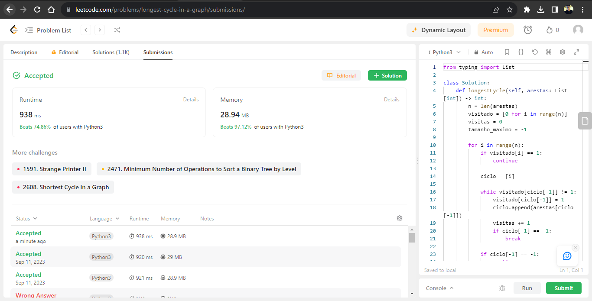
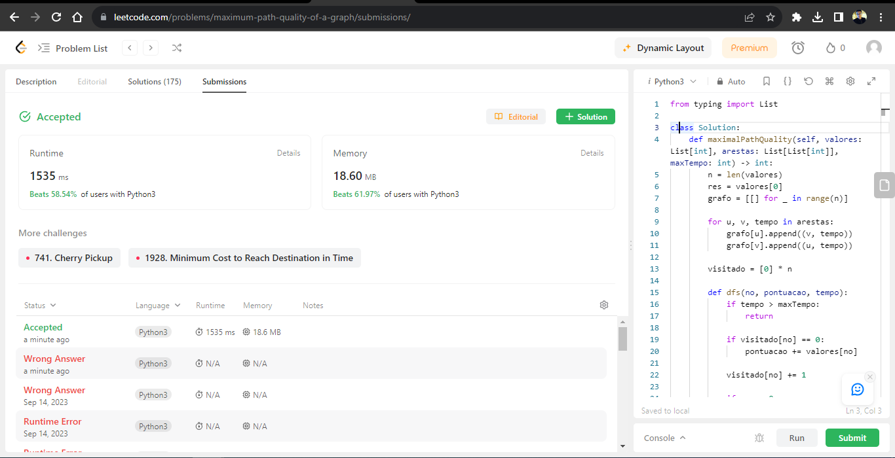
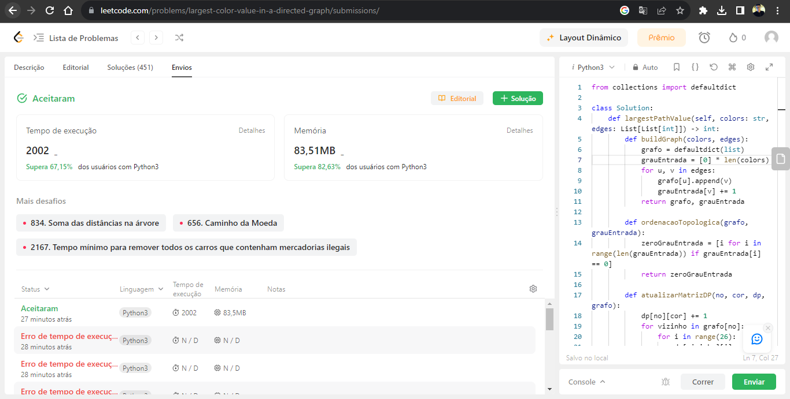
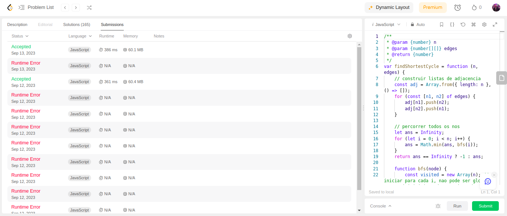
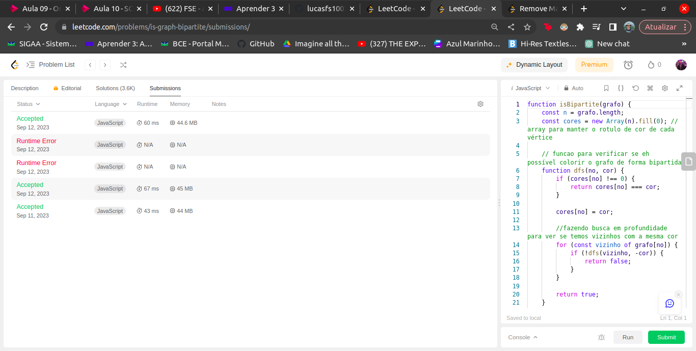
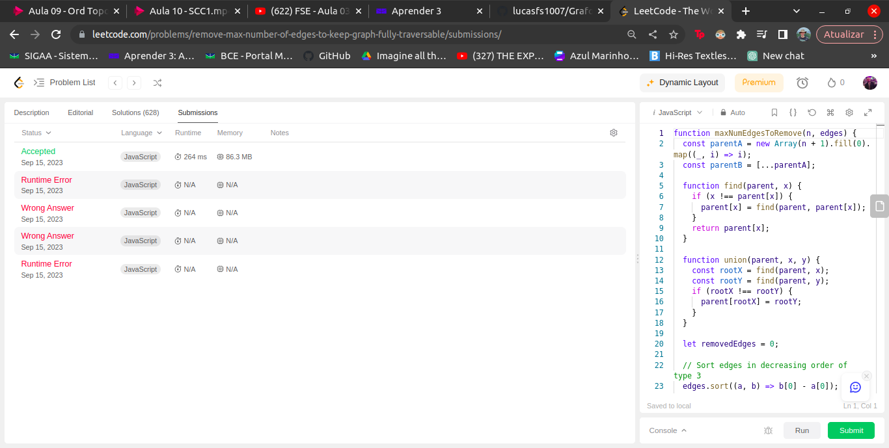

# Grafos 1 - Exércicios

**Número da Lista**: 1 
**Conteúdo da Disciplina**: Grafos 1 

## Alunos
|Matrícula | Aluno |
| -- | -- |
| 19/0033681  | Luiz Henrique Fernandes Zamprogno |
| 20/2016767  | Lucas Felipe Soares |

## Sobre 

A aplicação dos conceitos de Grafos 1 aprendidos na disciplina de Projeto de Algoritmos da disciplina foi realizada por meio da realização de 5 exercícios sobre o assunto de grafos. Exercícios Executados:

### Exércicios executados

| Exercício | Dificuldade | Id Leetcode | Linguagem | Código |
| -- | -- | -- | -- | -- |
| [2360 - Ciclo mais longo em um gráfico](https://github.com/lucasfs1007/Grafos1_ExerciciosResolvidos/blob/master/2360%20-%20Ciclo%20mais%20longo%20em%20um%20gr%C3%A1fico.pdf) | Dificil | [2360](https://leetcode.com/problems/longest-cycle-in-a-graph/) | Python3 | [2360-CicloMaisLongo.py](https://github.com/lucasfs1007/Grafos1_ExerciciosResolvidos/blob/master/2360-CicloMaisLongo.py) |
| [2065 - Qualidade máxima do caminho de um gráfico](https://github.com/lucasfs1007/Grafos1_ExerciciosResolvidos/blob/master/2065%20-%20Qualidade%20m%C3%A1xima%20do%20caminho%20de%20um%20gr%C3%A1fico.pdf) | Dificil | [2065](https://leetcode.com/problems/maximum-path-quality-of-a-graph/description/) | Python3 | [2065-QuantCaminhosValidos.py](https://github.com/lucasfs1007/Grafos1_ExerciciosResolvidos/blob/master/2065-QuantCaminhosValidos.py)  |
| [1857 - Maior valor de cor em um gráfico direcionado](https://github.com/lucasfs1007/Grafos1_ExerciciosResolvidos/blob/master/1857%20-%20Maior%20valor%20de%20cor%20em%20um%20gr%C3%A1fico%20direcionado.pdf) | Dificil | [1857](https://leetcode.com/problems/largest-color-value-in-a-directed-graph/description/)| Python3 | [1857-MaiorValCorGraficoDir.py](https://github.com/lucasfs1007/Grafos1_ExerciciosResolvidos/blob/master/1857-MaiorValCorGraficoDir.py)  |
| [2608 - Ciclo mais curto em um grafo](https://github.com/lucasfs1007/Grafos1_ExerciciosResolvidos/blob/master/2608%20-%20Ciclo%20mais%20Curto%20em%20um%20grafo.pdf) | Dificil | [2608](https://leetcode.com/problems/shortest-cycle-in-a-graph/) | Javascript |  [2608-cicloMaisCurto.js](https://github.com/lucasfs1007/Grafos1_ExerciciosResolvidos/blob/master/2608-ciclomaisCurto.js) |
| [785 - Verifica se o grafo é bipartido](https://github.com/lucasfs1007/Grafos1_ExerciciosResolvidos/blob/master/785-verificaGrafoBiPartido.pdf) | médio | [785](https://leetcode.com/problems/is-graph-bipartite/description/) | Javascript |  [785-verificaGrafoBiPartido.js](https://github.com/lucasfs1007/Grafos1_ExerciciosResolvidos/blob/master/785-verificaGrafoBiPartido.js) |
| [1579- Remova o máximo de arestas para manter o grafo totalmente percorrível](https://github.com/lucasfs1007/Grafos1_ExerciciosResolvidos/blob/master/1579-removeMaxAresta.pdf) | Dificil | [1579](https://leetcode.com/problems/remove-max-number-of-edges-to-keep-graph-fully-traversable/) | Javascript |  [1579-removeMaxAresta.js](https://github.com/lucasfs1007/Grafos1_ExerciciosResolvidos/blob/master/1579-removeMaxAresta.js) |

## Video

[Video](https://youtu.be/F0Eox3h5700)

## Screenshots

### 2360 - Ciclo mais longo em um gráfico

### 2065 - Qualidade máxima do caminho de um gráfico

### 1857 - Maior valor de cor em um gráfico direcionado

### 2608 - Ciclo mais curto em um grafo

### 785 - Verifica se o grafo é bipartido

### 1579- Remova o máximo de arestas para manter o grafo totalmente percorrível

## Instalação 

Não é necessario instalação, os exercicios devem ser rodados no site [leetcode]([link](https://leetcode.com/problemset/all/)).

**Linguagem 1**: Python3 
**Linguagem 2**: Javascript 

## Uso

1. Acesse o site [LeetCode](https://leetcode.com/problemset/all/).

2. Crie uma conta e faça o login.

3. Vá para o link do exercício desejado, que pode ser encontrado na coluna "Id LeetCode" da tabela de exercícios executados.

4. Selecione a linguagem de programação correspondente ao exercício, indicada na coluna "Linguagem" da tabela de exercícios executados.

5. Copie o código correspondente encontrado na coluna "Código" da tabela de exercícios executados.

6. Clique no botão "Enviar" no canto inferior direito e verifique a execução correta do código.

## Outros

As questões foram implementadas em duas linguagens diferentes para explorar a aplicação de conhecimentos em linguagens distintas.

